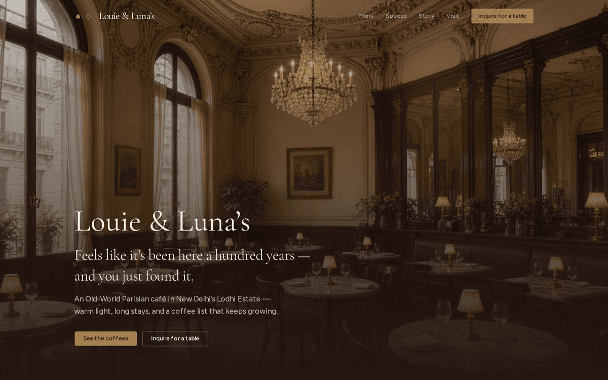
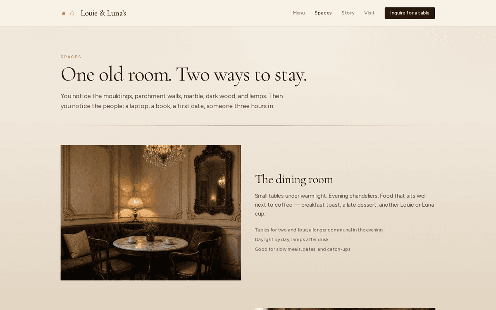
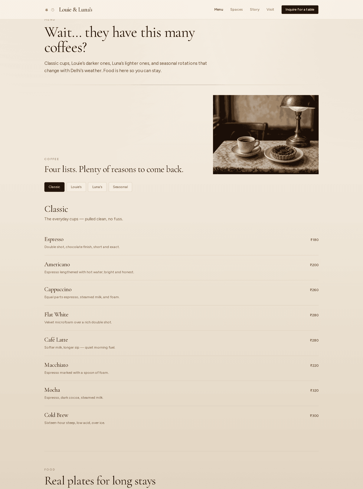

# Louie & Luna's

The website for a café that doesn't exist.

I'm a coffee enthusiast, and I've spent most of the last four months studying in cafés. Somewhere in there I started imagining my own — an Old-World Parisian one — and rather than let it stay a daydream, I figured the easiest way to actually see it was to build its website.

So: Louie & Luna's sits in a leafy Lodhi Estate bungalow in New Delhi. Belle Époque interiors, a dining space, and a co-working corner for people like me who study in cafés. Louie and Luna are the two Persian cats who run the place in spirit — Louie black, Luna white — and there's a silly bit of lore that they used to be an Indian couple in their forties and somehow ended up as cats.

The menu is the real point. Way too many coffees, split into four lists: Classic, Louie's (darker, bolder), Luna's (lighter, floral), and Seasonal.

It's a fictional café and a fun side project. I also used it as an excuse to get comfortable building things with Cursor.

**Live:** [louie-and-lunas-cafe.vercel.app](https://louie-and-lunas-cafe.vercel.app)

<p>
  
  
</p>
<p>
  
</p>

## Stack

Next.js (App Router), TypeScript, Tailwind CSS, shadcn/ui.

## Run locally

```bash
npm install
npm run dev
```

Then open [http://127.0.0.1:4321](http://127.0.0.1:4321).

## What's in here

| Route | |
|---|---|
| `/` | The hero shot and a quick tour of the room |
| `/menu` | The four coffee lists, plus food |
| `/spaces` | Dining room and the co-working corner |
| `/story` | How Louie and Luna ended up as cats |
| `/visit` | Address, hours, and a table inquiry that just opens an email |

## One note

The address, phone number, hours, and prices are all made up, and the images are AI-generated.
